# Howto use STM32CubeIDE with ST-LINK V1 (or any other gdbserver compatible debugger)

## Introduction
ST-LINK V1 is initial (and currently obsolete) version of ST-LINK debugging tool. The debugger version is
not supported by current STM32CubeIDE software which make certain older evaluation board off-the-shelf incompatible. Certain hobbyists and universities asked us about possibilities of using ST-LINK V1 boards with current IDEs. Nevertheless, form certain scope, STM32CubeIDE is a tool "open for modification" and it is possible to set STM32CubeIDE with ST-LINK V1.

For the purpose of this tutorial let's assume reader is familiar with STM32CubeIDE -- knows how to set a project and how to debug it using ST-LINK V2/V3. The tutorial suggests using STM32VLDISCOVERY board (although it may be applied to other ST-LINK V1 boards like STM32L152-EVAL (MB819 Rev.A), or standalone ST-LINK V1).

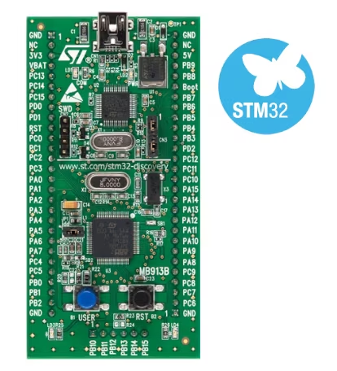

## Needed additional tools

Actual problem is that gdb-server included in STM32CubeIDE is not compatible with ST-LINK V1. Nevertheless, there is open gdb-server that is compatible with ST-Link V1 ([https://github.com/stlink-org/stlink](https://github.com/stlink-org/stlink)). After installation, the connection may be verified by running gdb-server form command line by (including erase of the device):

```
st-flash erase && st-util -1 -m -p 4242
```

when everything is set correctly there should be following output:

```
st-flash 1.8.0
2025-03-21T09:12:03 INFO common.c: STM32F1xx_VL_MD_LD: 8 KiB SRAM, 128 KiB flash in at least 1 KiB pages.
Mass erasing...
Mass erase completed successfully.
2025-03-21T09:12:04 INFO common.c: NRST is not connected --> using software reset via AIRCR
st-util: unknown option -- 1
st-util 1.8.0
2025-03-21T09:12:04 INFO common.c: NRST is not connected --> using software reset via AIRCR
2025-03-21T09:12:04 INFO common.c: STM32F1xx_VL_MD_LD: 8 KiB SRAM, 128 KiB flash in at least 1 KiB pages.
2025-03-21T09:12:04 INFO gdb-server.c: Listening at *:4242...
```

When the tool cannot find the ST-LINK, there are probably wrongly set drivers (quite common), this may be fixed with zadig (https://zadig.akeo.ie/ also included in the tools folder) -- the tools is straightforward to use (according to following screenshot of result; one hint at the beginning the devices need to be listed by _Options_->_List All Devices_).

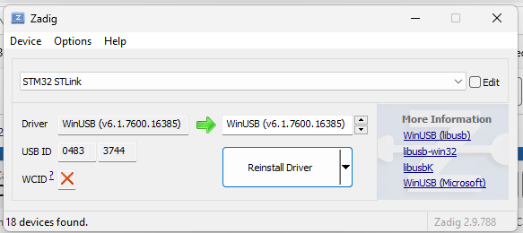

## Setting STM32CubeIDE

Before setting new configuration for the gdb-server it is needed to create a firmware project for target STM32 and build it (assumed reader knows how, otherwise please see following [video](https://www.youtube.com/watch?v=Azr5vjbgACM)). When gdb-server is set, it is needed to set CubeIDE, there needs to be set new debug configuration (according to screenshot01-02), and set parameters (according to screenshot03-04).

Open "Debug Configurations...":

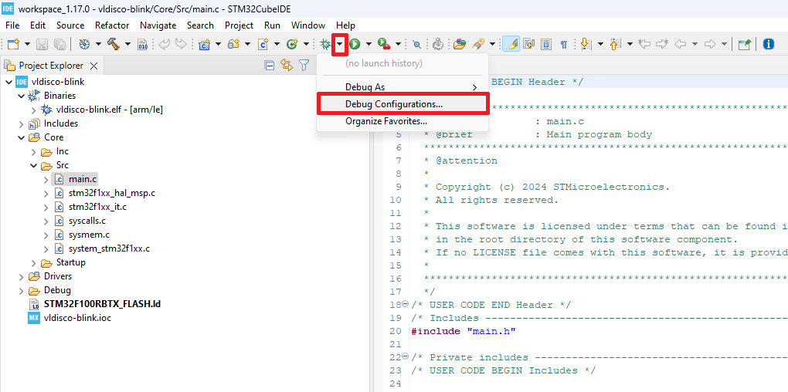

By RMB create "New Configuration":

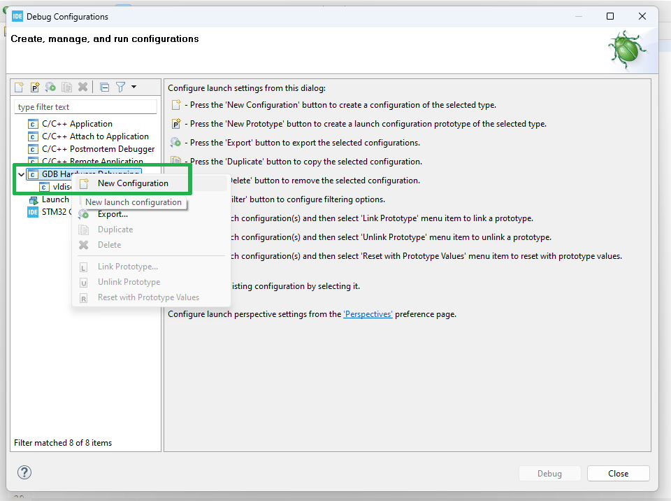

Add path to .elf file (project need to be successfully built before):

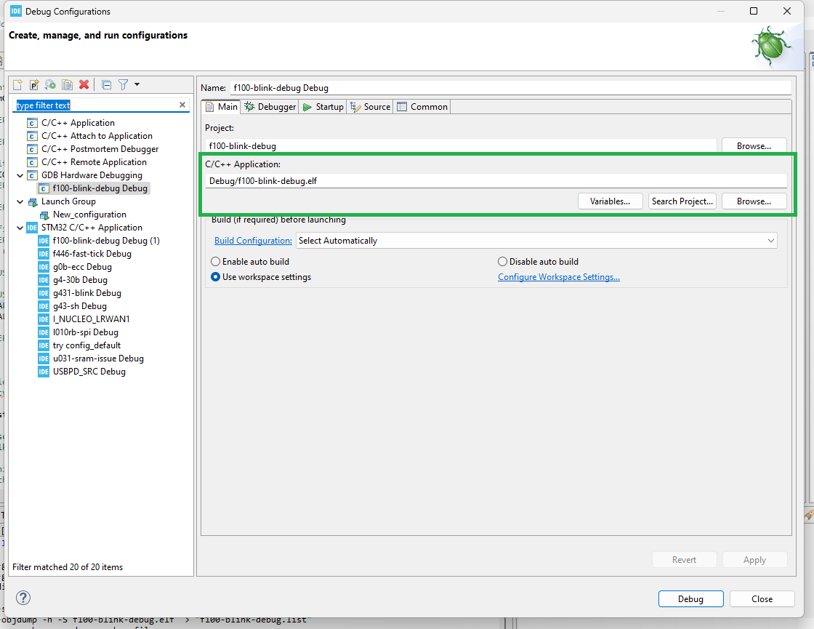

Set gdb command as `${gnu_tools_for_stm32_compiler_path}/arm-none-eabi-gdb.exe`, server "ST-LINK" and port (4242).

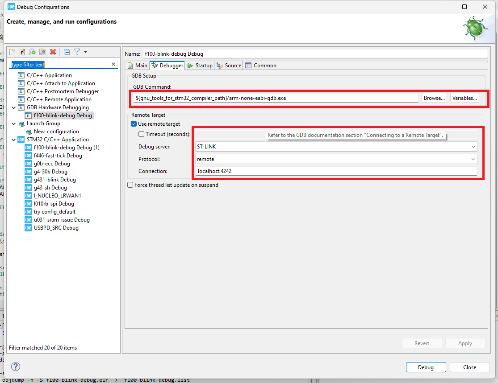

Additionally it is beneficial to set gdb-server to start with debug session (according to screenshot05-14), firstly it is needed to open "External Tools Configurations...":

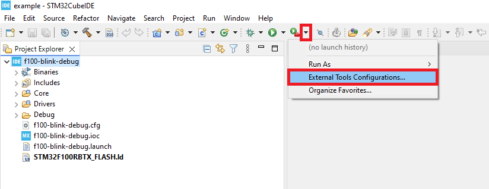

It is needed to create a "New Configuration":

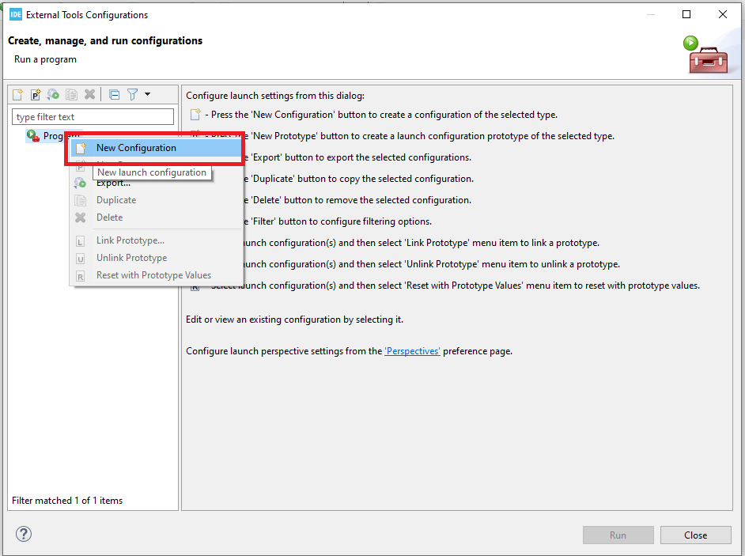

The configuration needs selecting path to gdb-server. It is useful to make a helping batch `run.bat` containing `st-flash erase && st-util -1 -m -p 4242`:

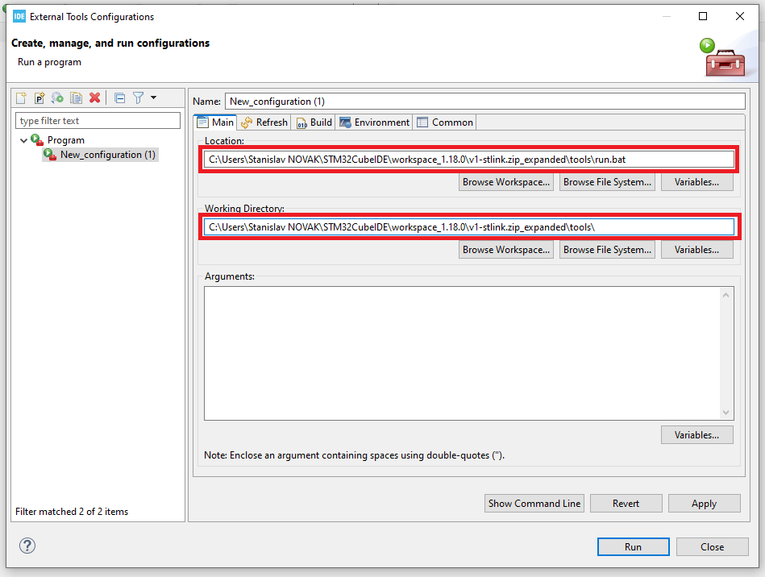

On the "Build" tab is needed to uncheck "Build before launch" (as it was already done before):

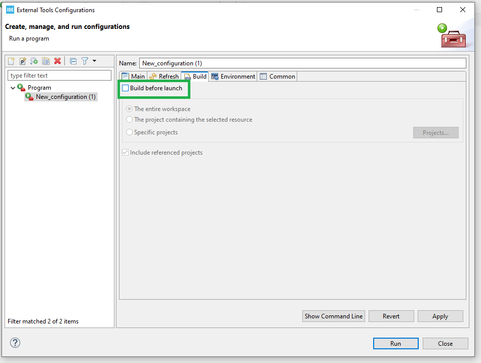

In debug configuration it is useful to add launch configuration to connect the previous two configurations together:

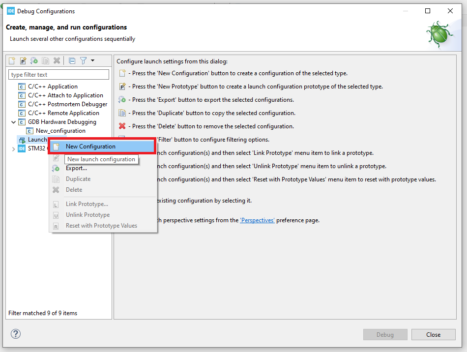

By "Add..", 

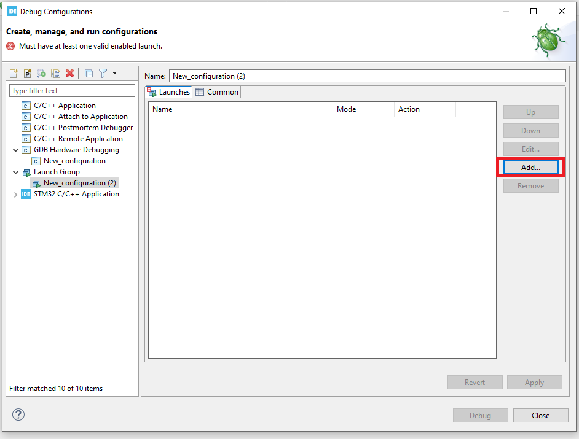

can be added the configurations,

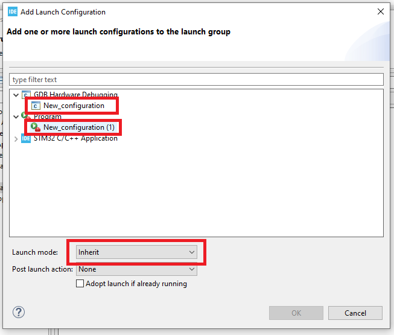

and set accordingly:

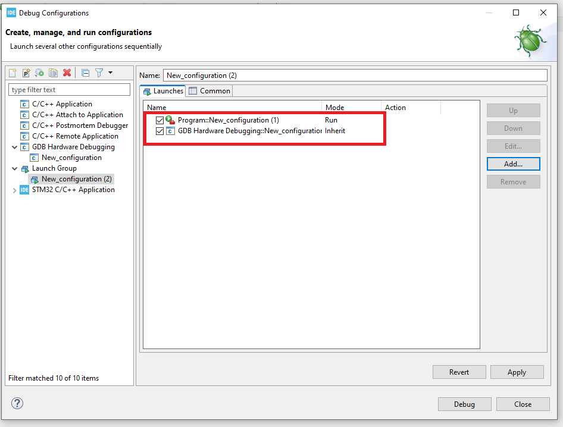

Debug session may be entered by the launch configuration,

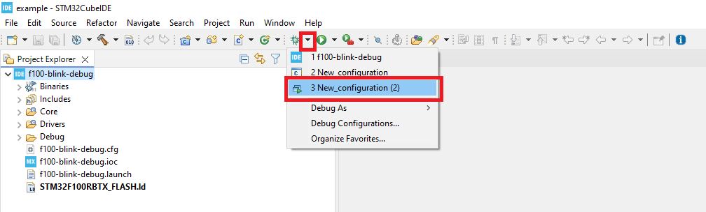

When everything correctly set, debug session should be entered and work similar to ST-LINK/V2 (attached screenshot for reference).

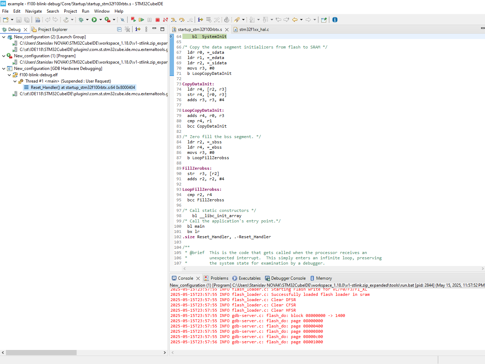

## Final notes

As mentioned in the title, similar approach may be used with 3rd party tools that are gdb based. When using such 3rd party debugger, **please follow the license terms of the actual 3rd party debugger to avoid inconvenience.** There is also following tutorial ([Howto use 3rd party debuggers in STM32CubeIDE using OpenOCD]()) about OpenOCD (in combination with RLink, as an example); for ST-LINK V1 the OpenOCD approach is also possible. 